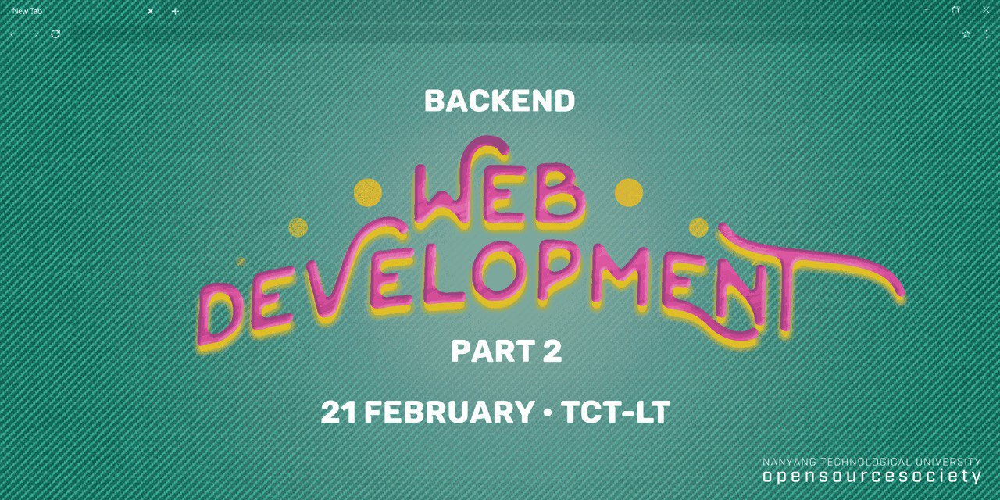
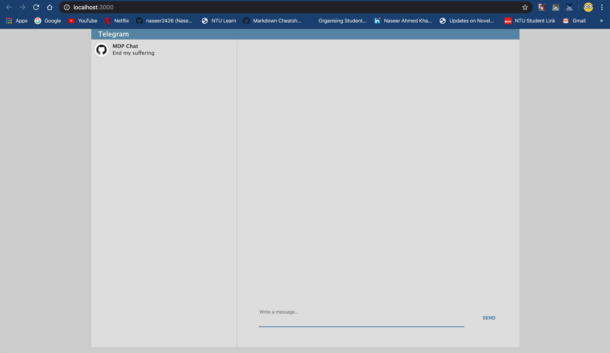
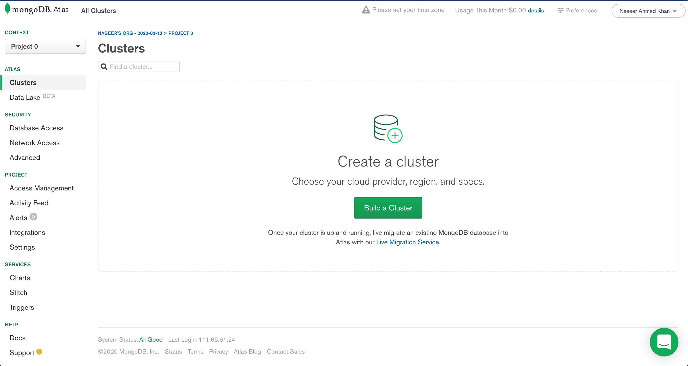

# NTUOSS Web Backend Workshop

_by [Naseer Ahmed Khan](https://github.com/naseer2426) for [NTU Open Source Society](https://github.com/ntuoss)_

This is the second workshop in the NTUOSS Web development workshop series. This workshop will build upon the beautiful front end developed in the first workshop. I highly recommend going through the first workshop [here](https://github.com/laksh22/NTUOSS-ReactWorkshop)


The slides for this workshop can be found [here](https://docs.google.com/presentation/d/1T5xnoAGCCvJUf19hBD-K34NyvVRfuVisPbnS5Rxuyhs/edit?usp=sharing)

---



_Artwork by Bryna Goh Jia Rui_

### Workshop Details

**When:** Friday, 21 February 2020. 6:30PM - 8:30PM  
**Where:** TCT-LT, Nanyang Technological University  
**Who:** NTU Open Source Society

### Questions

Please raise your hand any time during the workshop.

### Errors

For errors, typos or suggestions, please do not hesitate to [post an issue](https://github.com/naseer2426/Backend-Workshop/issues/new)! Pull requests are very welcome, thank you!

---

## Index

- [NTUOSS Web Backend Workshop](#ntuoss-web-backend-workshop)
    - [Workshop Details](#workshop-details)
    - [Questions](#questions)
    - [Errors](#errors)
  - [Index](#index)
  - [Prerequisites](#prerequisites)
  - [Getting started](#getting-started)
  - [Server code](#server-code)
    - [Simple Socket connection](#simple-socket-connection)
      - [Server side code to establish a socket connection](#server-side-code-to-establish-a-socket-connection)
      - [Client side code to establish socket connection](#client-side-code-to-establish-socket-connection)
      - [Sending messages from client to server](#sending-messages-from-client-to-server)
      - [Recieving messages from client in the server](#recieving-messages-from-client-in-the-server)
      - [Sending messages from server to client](#sending-messages-from-server-to-client)
      - [Recieving messages from server in client](#recieving-messages-from-server-in-client)
      - [Broadcasting messages to all connected clients](#broadcasting-messages-to-all-connected-clients)
    - [Setting up the group chat](#setting-up-the-group-chat)
      - [Server side code](#server-side-code)
      - [Client side code](#client-side-code)
    - [Setting up MongoDB](#setting-up-mongodb)
    - [Connecting to mongoDB from the server](#connecting-to-mongodb-from-the-server)
      - [Getting all the documents in your collection](#getting-all-the-documents-in-your-collection)
      - [Inserting a document into your collection](#inserting-a-document-into-your-collection)
    - [REST APIs](#rest-apis)
      - [GET Request](#get-request)
      - [POST Request](#post-request)
    - [Making REST API for MongoDB](#making-rest-api-for-mongodb)
    - [Deploying your server on Heroku](#deploying-your-server-on-heroku)
    - [Deploying your React app on github pages](#deploying-your-react-app-on-github-pages)

---

## Prerequisites

- Nodejs
  - Check if you have nodjs installed on your laptop by running the following command on terminal (Mac) or command line (windows)
```bash
node --version
```
  - If you don't have it installed, get it [here](https://nodejs.org/en/) (for Windows users)
  - Mac users can install brew by running
  ```bash
  mkdir homebrew && curl -L https://github.com/Homebrew/brew/tarball/master | tar xz --strip 1 -C homebrew
  ```
  - Then run
```bash
brew install node
```
- Postman
  - If you don't have postman installed get it [here](https://www.postman.com/downloads/)
- A text editor
  - Preferable Visual Studio Code because its amazing!
  - Get it [here](https://code.visualstudio.com/)

## Getting started

The first thing you need to do is clone this repository by running the following command on your terminal

```bash
git clone https://github.com/naseer2426/Backend-Workshop.git
```

If you don't have git installed you can download the zip of this repository [here](/naseer2426/Backend-Workshop/archive/master.zip). Unzip this file and you will get a folder called Backend-Workshop. Open terminal/command-line in this folder.

Next, you need to enter the client folder by running the following command

```bash
cd workshop_code/client
```

Install all the dependencies required for the front end by running

```bash
npm install
```

After the installation is complete, run the following command to check if the front end works perfectly..

```bash
npm start
```

You should see something like this




## Server code

Make a new folder called server inside the workshop_code folder. Enter this folder and open terminal here. Initialize node here by running the following command.

```bash
npm init -y
```

Install all the required dependencies by running

```bash
npm install --save body-parser cors express mongodb socket.io
```

Make a file named index.js, this will be your main file that runs your server code. Import all the dependencies into index.js

```javascript
var express = require("express");
var app = express();
const bodyParser = require("body-parser");
const { MongoClient } = require("mongodb");
const PORT = 8000;
const cors = require("cors")({ origin: true });
var server = require("http").Server(app);
var io = require("socket.io")(server);
app.use(bodyParser.json());
app.use(cors);
```

### Simple Socket connection

A simple socket connection requires socket code on both client and server side.

#### Server side code to establish a socket connection

```javascript
io.on("connection", socket => {
    console.log("connected new client");
    console.log(socket.id);
});


server.listen(PORT, () => {
    console.log(`Server listening to port ${PORT}`);
});
```

#### Client side code to establish socket connection

- Importing socket.io

    ```javascript
    import io from "socket.io-client";
    ```

- Assinging socket in the contructor
    ```javascript
    this.server = "https://localhost:8000";
    this.socket = io(this.server);
    ```

#### Sending messages from client to server

Sending a JSON message to the server is the easiest thing the world.

```javascript
this.socket.emit("send", newMessage);
```

#### Recieving messages from client in the server

```javascript
socket.on("send", data => {
        console.log(data);
    });
```

#### Sending messages from server to client

```javascript
socket.emit("recieving",data);
```

#### Recieving messages from server in client

```javascript
this.socket.on("recieving", data => {
            console.log(data);
        });
```

#### Broadcasting messages to all connected clients

```javascript
socket.broadcast.emit("recieving", data);
```


### Setting up the group chat

#### Server side code

```javascript
io.on("connection", socket => {
    console.log("connected");
    console.log(socket.id);

    socket.on("send", data => {
        socket.broadcast.emit("recieving", data);
    });
});

server.listen(PORT, () => {
    console.log(`Server listening to port ${PORT}`);
});
```

#### Client side code

Sending a message to the server

```javascript
var newMessage = {
            body: this.state.message,
            name: this.state.name
        };
this.setState(prevState => ({messages: [...prevState.messages, newMessage],message: ""}));

this.socket.emit("send", newMessage);
```

Recieving a broadcast message from the server


```javascript
this.socket.on("recieving", data => {
            this.setState(prevState => ({
                messages: [...prevState.messages, data]
            }));
        });
```

You would have noticed that all previous messages vanish when you reload the page. This is because we never save these messages anywhere. We need our own database to store our chats.


### Setting up MongoDB

To set up mongoDB, click [here](https://www.mongodb.com/) and sign in with google. Once you sign in, you need to create a new project


Once the project is created, you'll see something like this.



Next you need to create an admin user whose credentials will be used to access the database. Go to database access under security and add user.


Next you need to white-list your IP address to access the database. For now we will just allow all IP addresses to access our database


Now you create a cluster for your database.


### Connecting to mongoDB from the server

This is the server side code to connect to your MongoDB database.
```javascript
const uri = //Enter your URI;
const client = new MongoClient(uri, {
    useNewUrlParser: true,
    useUnifiedTopology: true
});

var messages;
client.connect(err => {
    if (err != null) {
        console.log(err);
    }
    messages = client.db("Telegram").collection("Chat");
    console.log("Connected to mongo boi");

});
```

#### Getting all the documents in your collection

```javascript
messages.find().toArray((err, docs) => {
        console.log(docs);
    });
```

#### Inserting a document into your collection

```javascript
var response = await messages.insertOne(req.body);
```

### REST APIs

There are different types of HTTP requests (GET,PUT,UPDATE,DELETE,POST etc.). You can use express to call a function whenever the client sends an HTTP request to the server.

#### GET Request

```javascript
app.get("/", async (req, res) => {
    //req has all the data sent by the client
    //res has everything you need to send back a response
});
```

#### POST Request

```javascript
app.post("/send", async (req, res) => {
    //req has all the data sent by the client
    //req.body will give you the json body sent by the client
    //res has everything you need to send back a response
});
```


### Making REST API for MongoDB

First we need an API to get all the messages. We can use a GET request for this. The following code goes in the server

```javascript
app.get("/", async (req, res) => {
    messages.find().toArray((err, docs) => {
        res.send(docs);
    });
});
```

We can call this API from the client side using the following code. 

```javascript
fetch(this.server)
            .then(res => res.json())
            .then(
                result => {
                    console.log(result);
                },
                error => {
                    console.log(error);
                }
            );
```

Next we make an API to add a mesasage to the database. This will be a POST request. The server side code is given below.

```javascript
app.post("/send", async (req, res) => {
    var response = await messages.insertOne(req.body);
    res.send(response);
});
```

You can make the post request from the client side using the following code.

```javascript
fetch(this.server + "/send", {
            method: "POST",
            headers: {
                "Content-Type": "application/json"
            },
            body: JSON.stringify(newMessage)
        })
            .then(res => res.json())
            .then(result => {
                console.log(result);
            });
    };
```

### Deploying your server on Heroku
You can deploy your server online so that anyone in the world can access it. To learn how to deploy a node server onto heroku, you can follow [this](https://devcenter.heroku.com/articles/deploying-nodejs) tutorial.

### Deploying your React app on github pages

Since this is a static web page, you can deploy your front end in any server. I chose to do it on github pages. To learn how to do this follow [this](https://dev.to/yuribenjamin/how-to-deploy-react-app-in-github-pages-2a1f) tutorial.


